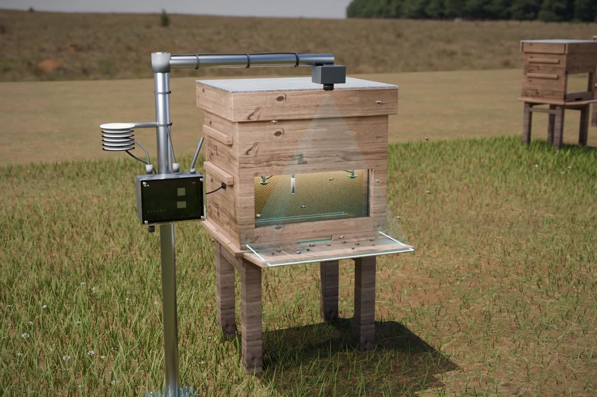
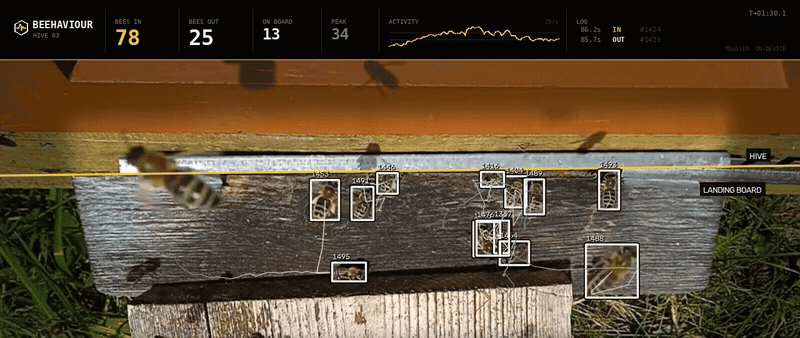
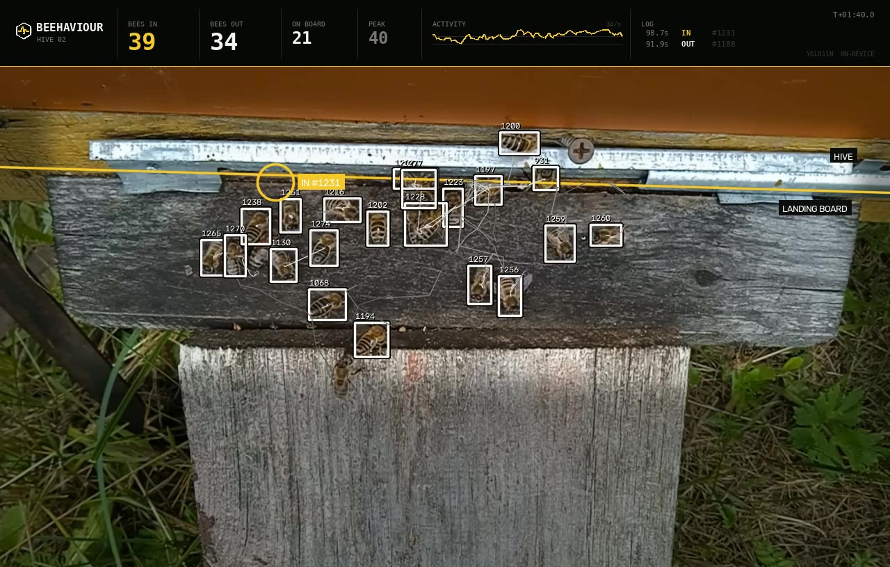
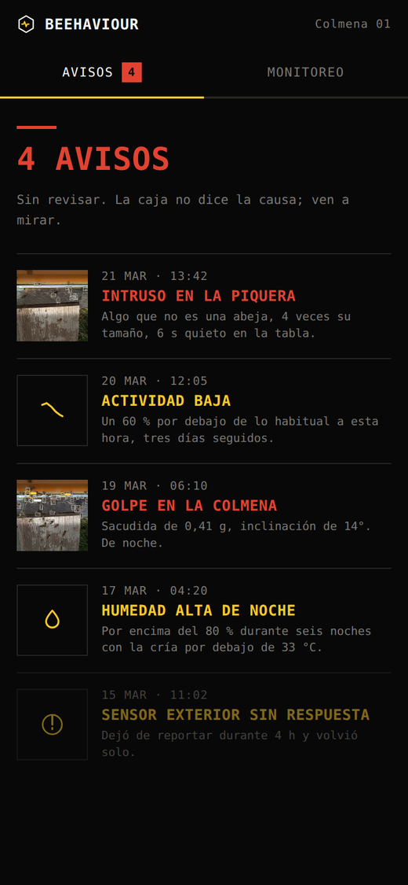
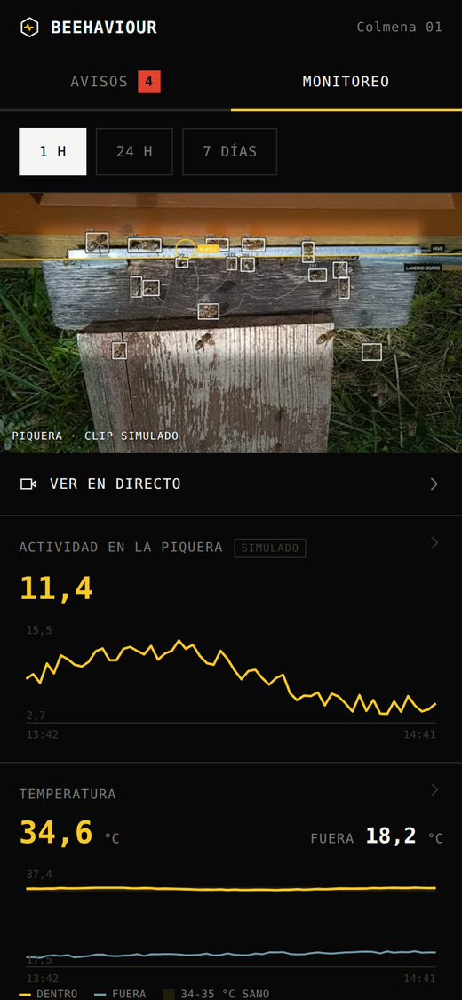
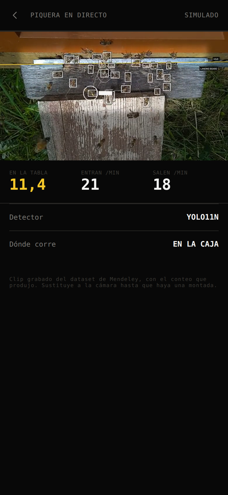

# Beehaviour

[](LICENSE)
[](https://www.python.org/)
[](https://github.com/ultralytics/ultralytics)

A hive guardian that works without internet and without mobile coverage. A box
with a camera watches the hive entrance, counts the bees going in and out,
flags anything that is not a bee, and stores it all on the device itself. When
the beekeeper reaches the apiary, they join the box's own WiFi from their phone
and see what has happened since the last visit.

Hackathon proof of concept. The functional design, written for beekeepers and
free of technical jargon, is in [DESIGN.md](DESIGN.md).

🎬 Demo video: [https://youtu.be/nuNUS15LLaE](https://youtu.be/nuNUS15LLaE)



This is what the system sees. Six seconds of real output: boxes and identifiers
come from the detector and the tracker, and along the top are the counters, the
per-second activity and the event log. The yellow circle on the left is an entry
being confirmed.



Full clips are in [media/](media/): the pipeline's input
([`entrada_cenital_muestra.mp4`](media/entrada_cenital_muestra.mp4)) and its
output for all three hives (`*_conteo.mp4`).

## Team

🐝 Jordi Calsina · Lluc Santamaria · Guido Biosca · Victor Abelló

---

## Getting started in two minutes

You need neither the 7.8 GB dataset nor a GPU. Every detection from the three
runs is saved in `out/*_dets.npz`, and the pipeline can replay them: counting
and drawing come out identical, in seconds instead of minutes.

```bash
git clone https://github.com/jordicalsinabaldoma/beehavior-upc.git
cd beehavior-upc

python3 -m venv .venv
.venv/bin/pip install -r requirements.txt
```

1. The panel the beekeeper opens on their phone. Generated straight from the
CSV, no video involved. It is the quickest thing to try:

```bash
.venv/bin/python src/make_dashboard.py \
    --csv out/20230711b-fan.csv \
    --events out/20230711b-fan_events.csv \
    --hive "HIVE 03" \
    -o panel.html
```

Open it in a browser. There is a pre-generated example at
[docs/panel_apicultor.html](docs/panel_apicultor.html).

2. Redraw the annotated video from the saved detections. This one needs the
original video, which is not in the repo because of its size (see below). With
it:

```bash
.venv/bin/python src/beecount.py <path>/20230711b-fan.mp4 \
    --from-dets out/20230711b-fan_dets.npz \
    --zone dataset-sample/zones/entrance_zone_20230711b-fan.txt \
    --layout strip --title "HIVE 03" \
    -o output.mp4 \
    --csv output.csv --events-csv output_events.csv
```

Or all three at once, with `VIDEOS_DIR` pointing at wherever they live:

```bash
VIDEOS_DIR=/path/to/videos ./rerender.sh
```

3. Re-measure the quality against the dataset's annotations, again without
running the detector:

```bash
.venv/bin/python src/evaluate.py \
    --gt "<dataset>/tracking_and_behavior/tracks_20230711b-fan.txt" \
    --zone dataset-sample/zones/entrance_zone_20230711b-fan.txt \
    --dets out/20230711b-fan_dets.npz \
    --ours-in 96 --ours-out 28
```

### The whole pipeline, from scratch

This needs the full dataset: 7.8 GB,
[doi.org/10.17632/8gb9r2yhfc.6](https://doi.org/10.17632/8gb9r2yhfc.6) (CC BY 4.0).
Unpack it wherever you like and call that folder `<dataset>`.

```bash
# 1. Assemble the YOLO dataset. Split BY HIVE: the three hives from the test
#    videos are held out of training entirely.
.venv/bin/python src/build_dataset.py --src "<dataset>/detection"

# 2. Train. 7 epochs, about an hour on a laptop GPU.
.venv/bin/yolo detect train model=yolo11n.pt data=data/yolo_bees/bees.yaml \
    epochs=7 imgsz=640 name=bee11n

# 3. Pick the confidence threshold, on the validation split.
.venv/bin/python src/pick_conf.py --weights models/bee11n.pt

# 4. The three videos: detect, count, render and evaluate.
DATASET="<dataset>" ./run_all.sh models/bee11n.pt
```

Skip step 2 and `models/bee11n.pt` is already the trained model that produces
the figures below.

[`run_all.sh`](run_all.sh) and [`rerender.sh`](rerender.sh) read four
environment variables:

| Variable | Default | What for |
|---|---|---|
| `PYTHON` | `.venv/bin/python` | The interpreter |
| `DATASET` | `data/Labeled dataset for…` | Root of the unpacked dataset |
| `GT` | `$DATASET/tracking_and_behavior` | Annotations and entrance polygons |
| `VIDEOS_DIR` | `$GT` | Where the three original `.mp4` files are |

### Running it on your own video

```bash
.venv/bin/python src/beecount.py my_hive.mp4 \
    --weights models/bee11n.pt \
    --line 0.35 \
    --conf 0.40 --imgsz 640 --skip 2 \
    -o output.mp4 --csv output.csv --events-csv output_events.csv
```

`--line` is the height of the entrance slot as a fraction of the frame height,
and replaces `--zone` when there is no annotated polygon. Everything above that
line is "inside the hive". `beecount.py --help` lists the rest: render size,
side panel, intruder threshold, confirmation delay.

---

## What is in this repository

| Folder | What it is |
|---|---|
| [src/](src/) | The vision pipeline: detection, tracking, counting, evaluation and rendering |
| [box/](box/) | The box's app (Arduino UNO Q): the MCU sketch, the Python server and the local web UI |
| [blender/](blender/) | The 3D mock-up of the station, generated from code |
| [dataset-sample/](dataset-sample/) | 14 labelled frames and the 3 entrance polygons, to show the format |
| [media/](media/) | Short clips: the pipeline's input and its counting output |
| [out/](out/) | Results of the three runs: figures, events and saved detections |
| [models/](models/) | The trained weights (21 MB) and the training curve |
| [docs/](docs/) | README images, renders and the example panel |

The original videos are not here. They are 128-205 MB each, above GitHub's
100 MB per-file limit, and they belong to the Mendeley dataset, which already
has a public DOI. The full annotated videos are 60-74 MB and are
regenerated in seconds with `rerender.sh`. Short clips of both are in `media/`.

### The scripts

| File | What it does |
|---|---|
| [beecount.py](src/beecount.py) | The main pipeline: detect, track, count, alert and draw |
| [overlay.py](src/overlay.py) | The video's instrument strip, kept apart so it can be redesigned alone |
| [build_dataset.py](src/build_dataset.py) | Assembles the YOLO dataset, splitting by hive |
| [pick_conf.py](src/pick_conf.py) | Picks the confidence threshold on the validation split |
| [evaluate.py](src/evaluate.py) | Detection precision/recall and counting error against the annotations |
| [plot_compare.py](src/plot_compare.py) | Activity chart: each method against the ground truth |
| [make_dashboard.py](src/make_dashboard.py) | Generates the self-contained HTML the box serves |
| [make_intruder_clip.py](src/make_intruder_clip.py) | Composites a synthetic intruder for the demo |
| [logo_intro.py](src/logo_intro.py) | Draws the animated wordmark at the top of this README |
| [beetrack.py](src/beetrack.py) | The earlier PoC, with no trained model: MOG2 + tracking. Kept as a baseline |

---

## How it works

```
top-down video of the hive entrance
   ↓
detection     YOLO11n, one class ("bee"), 640 px
   ↓
tracking      Hungarian assignment on predicted centroid distance + IoU
   ↓
counting      delayed confirmation at the entrance slot
   ↓
intruder      motion the bee detector does not explain
   ↓
per-second CSV + event CSV + annotated video + phone panel
```

### The detector

YOLO11n trained for 7 epochs on 1,756 labelled frames. The split is by hive,
not by frame: the three hives that appear in the test videos (`20230609b`,
`20230711a`, `20230711b`) are held out of training entirely. Splitting frames at
random would put two nearly identical consecutive frames one in train and one in
val, and the metrics would come out inflated.

mAP50 0.944 on validation. The confidence threshold (0.40) is also chosen on
validation, never on the test videos.

### The counting, and why it is not a line crossing

The obvious approach is to count crossings of a virtual line at the entrance.
It does not work: a bee does not cross the edge of the landing board, it
disappears into the slot. And the tracker loses and invents identities
constantly once there are twenty bees piled up.

Counting works by delayed confirmation instead:

- Going in: a track is lost inside the entrance zone *and the spot where it
  vanished stays empty* a moment later. If a bee shows up there again, it was
  the tracker swapping identities, not an entry.
- Coming out: a track appears at the slot *and that spot was empty* before.

Each track counts at most once. The entrance zone is read from the dataset's
annotated polygon (`--zone`), not tuned by hand.

Below, an entry being confirmed (the circle and the `IN #1231` label). It is
also the hard case: 21 bees on the board at once, which is where the counting
falls short.



### The intruder

The dataset contains bees only: there is no real Asian hornet footage. The
intruder detector looks for motion the bee detector does not explain, large
and slow relative to the median bee in the scene, so it calibrates itself to the
camera distance.

[`make_intruder_clip.py`](src/make_intruder_clip.py) composites a synthetic
intruder over the landing board to demonstrate it. It is a stand-in
for a demo, not evidence that real hornets are detected.

---

## Results

Three 2-minute videos, 1080p at 50 fps, processed at 25 fps. None of these three
hives was used for training.

Detection, against the dataset's annotated boxes (IoU ≥ 0.3):

| video | annotated boxes | precision | recall | F1 |
|---|---:|---:|---:|---:|
| 20230609b-def | 15,164 | 0.812 | 0.826 | 0.819 |
| 20230711a-fan | 63,721 | 0.904 | 0.912 | 0.908 |
| 20230711b-fan | 36,428 | 0.871 | 0.798 | 0.833 |

Counting, against the same rules applied to the annotated trajectories:

| video | entries (truth → ours) | exits (truth → ours) |
|---|---|---|
| 20230609b-def | 124 → 87 (−30 %) | 11 → 9 (−18 %) |
| 20230711a-fan | 162 → 41 (−75 %) | 133 → 41 (−69 %) |
| 20230711b-fan | 293 → 96 (−67 %) | 20 → 28 (+40 %) |

The counting undercounts, badly. This is worth being explicit about:
per-frame detection is good (F1 0.82-0.91), but counting events requires holding
each bee's identity for seconds, and that is where the tracker breaks. The worst
case, `20230711a-fan`, averages 25 simultaneous bees on the board; at that
density tracks fragment and the "the spot stays empty" rule discards entries
that did happen.

For the actual use case this matters less than it looks. The system does not
need the exact number, it needs to notice that today this hive is behaving
differently from how it normally behaves. A constant bias does not break a
baseline. But the figure must not be presented as an exact count.

The `out/*_actividad.png` charts compare, second by second, how many bees each
method sees against the annotated ground truth.

Speed: 29 ms per frame of detection (960×540, imgsz 640) on a laptop GPU.
The higher figures in some of the `out/*.log` files are GPU contention with the
renderer, not the detector. Not yet measured on the Arduino UNO Q.

---

## The box

[box/](box/) is the App Lab app that runs on the board: it reads whichever
Modulino sensors are plugged in, stores them, serves them over its own WiFi and
shows them in a web UI with no framework, no CDN and no internet. Its
[README](box/README.md) covers the hardware traps, among them the fact that the
UNO Q's Qwiic connector hangs off the microcontroller's second I2C bus and
not off the SoC, so from Linux the sensors are invisible and have to be read on
the MCU and passed over the Bridge.

This is what the beekeeper opens on their phone on arriving at the apiary. The
interface is in Spanish, for Spanish beekeepers.

| Alerts since the last visit | Monitoring | Live entrance |
|---|---|---|
|  |  |  |

The alert list says what changed, never why: "the box does not tell you the
cause, come and look". The greyed-out last entry is a sensor in the `stale`
state, which is an alert in itself rather than a missing sensor. The monitoring
screen puts the inside temperature against the outside one, with the healthy
34-35 C band marked, because a brood temperature that starts tracking the
outside air is the sign of a colony in trouble. The live view names the detector
and where it runs, and labels itself as a recorded clip, because there is no
camera mounted yet.

It will eventually get its own repository.

## The 3D mock-up

[blender/](blender/) generates the whole scene from code (`blender/bh_*.py`):
the box, the apiary, the environment and the camera framings. The `.blend` files
are not versioned because they are the output, not the source; they are rebuilt
with:

```bash
blender --background --python blender/run.py
```

The renders are in [docs/renders/](docs/renders/).

---

## Limitations

- Counting undercounts at high bee density, see above.
- Two bees touching are sometimes detected as one.
- The intruder alert has never been tested against a real hornet.
- Nothing measured on the board: every speed figure is from a laptop.
- The box has no real-time clock and no NTP; the time is set by hand.

## Next steps

- A tracker with appearance-based re-identification, which is where the large error is.
- Measuring real fps on the Arduino UNO Q with the camera attached.
- A per-hive baseline: learn what a normal day looks like for *this* hive and alert
  on the deviation, instead of reporting absolute figures.
- Joining the camera's counting with the box's sensor database.

---

## Licence and credits

The code in this repository is under AGPL-3.0 ([LICENSE](LICENSE)). That is
not an aesthetic choice: the pipeline uses
[Ultralytics](https://github.com/ultralytics/ultralytics) YOLO11, which is
AGPL-3.0, and the weights in `models/` are a derivative work. Any closed
commercial use would need an Ultralytics Enterprise licence.

The data, videos and images in `dataset-sample/`, `media/`, `docs/` and `out/`
derive from:

> Sledevic, Tomyslav (2024), *Labeled dataset for bee detection and direction
> estimation on beehive landing boards*, V6, Mendeley Data,
> [doi:10.17632/8gb9r2yhfc.6](https://doi.org/10.17632/8gb9r2yhfc.6), CC BY 4.0,
> Vilnius Gediminas Technical University.

The 3D mock-up's textures and HDRI come from [Poly Haven](https://polyhaven.com)
(CC0) and are not versioned; the scripts in `blender/` download them.

Full detail in [CREDITS.md](CREDITS.md).
