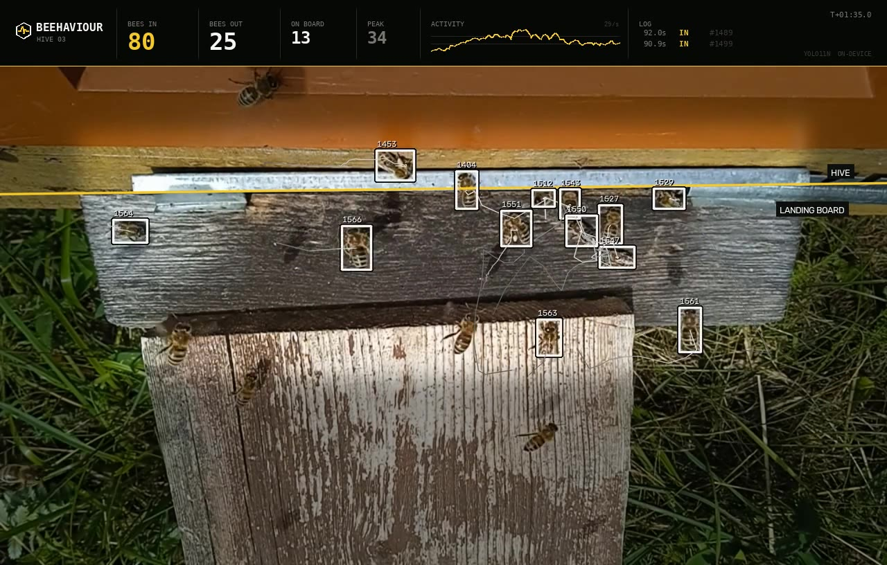

# Beehaviour

Guardián de colmena que funciona **sin internet, sin cobertura y sin nube**. Una
caja con una cámara mira la piquera, cuenta las abejas que entran y salen, avisa
de lo que no es una abeja y lo guarda todo dentro del propio dispositivo. Cuando
el apicultor llega al colmenar, se conecta con el móvil al WiFi de la caja y ve
qué ha pasado desde la última visita.

Prueba de concepto de hackathon. El diseño funcional, pensado para apicultores y
sin jerga técnica, está en **[DISEÑO.md](DISEÑO.md)**.


Esto es lo que ve el sistema. Cajas e identificadores son el detector y el
tracker; arriba, los contadores, la actividad por segundo y el registro de
eventos:



Clips completos en [media/](media/): la entrada del pipeline
([`entrada_cenital_muestra.mp4`](media/entrada_cenital_muestra.mp4)) y la salida
de las tres colmenas (`*_conteo.mp4`).

---

## Empezar en dos minutos

No hace falta descargar el dataset de 7,8 GB ni tener GPU. En `out/*_dets.npz`
están guardadas todas las detecciones de las tres ejecuciones, y el pipeline las
puede reproducir: el conteo y el dibujo salen **idénticos**, en segundos en vez
de en minutos.

```bash
git clone https://github.com/jordicalsinabaldoma/beehavior-upc.git
cd beehavior-upc

python3 -m venv .venv
.venv/bin/pip install -r requirements.txt
```

**1. El panel que el apicultor abre en el móvil.** Se genera solo del CSV, sin
tocar vídeo. Es lo más rápido de probar:

```bash
.venv/bin/python src/make_dashboard.py \
    --csv out/20230711b-fan.csv \
    --events out/20230711b-fan_events.csv \
    --hive "HIVE 03" \
    -o panel.html
```

Ábrelo en el navegador. Hay un ejemplo ya generado en
[docs/panel_apicultor.html](docs/panel_apicultor.html).

**2. Rehacer el vídeo anotado desde las detecciones guardadas.** Necesita el
vídeo original, que no está en el repo por tamaño (ver abajo). Con él:

```bash
.venv/bin/python src/beecount.py <ruta>/20230711b-fan.mp4 \
    --from-dets out/20230711b-fan_dets.npz \
    --zone dataset-sample/zones/entrance_zone_20230711b-fan.txt \
    --layout strip --title "HIVE 03" \
    -o salida.mp4 \
    --csv salida.csv --events-csv salida_events.csv
```

O los tres de golpe, con `VIDEOS_DIR` apuntando a donde estén:

```bash
VIDEOS_DIR=/ruta/a/los/videos ./rerender.sh
```

**3. Volver a medir la calidad** contra las anotaciones del dataset, sin
ejecutar el detector:

```bash
.venv/bin/python src/evaluate.py \
    --gt "<dataset>/tracking_and_behavior/tracks_20230711b-fan.txt" \
    --zone dataset-sample/zones/entrance_zone_20230711b-fan.txt \
    --dets out/20230711b-fan_dets.npz \
    --ours-in 96 --ours-out 28
```

### El pipeline entero, desde cero

Hace falta el dataset completo: 7,8 GB,
[doi.org/10.17632/8gb9r2yhfc.6](https://doi.org/10.17632/8gb9r2yhfc.6) (CC BY 4.0).
Descomprímelo donde quieras y llama a esa carpeta `<dataset>`.

```bash
# 1. Montar el dataset YOLO. Reparte POR COLMENA: las tres colmenas de los
#    vídeos de prueba quedan fuera del entrenamiento por completo.
.venv/bin/python src/build_dataset.py --src "<dataset>/detection"

# 2. Entrenar. 7 épocas, ~1 h en GPU de portátil.
.venv/bin/yolo detect train model=yolo11n.pt data=data/yolo_bees/bees.yaml \
    epochs=7 imgsz=640 name=bee11n

# 3. Elegir el umbral de confianza, en el split de validación.
.venv/bin/python src/pick_conf.py --weights models/bee11n.pt

# 4. Los tres vídeos: detectar, contar, renderizar y evaluar.
DATASET="<dataset>" ./run_all.sh models/bee11n.pt
```

Si te saltas el paso 2, `models/bee11n.pt` ya son los pesos entrenados que dan
las cifras de más abajo.

[`run_all.sh`](run_all.sh) y [`rerender.sh`](rerender.sh) leen cuatro variables
de entorno:

| Variable | Por defecto | Para qué |
|---|---|---|
| `PYTHON` | `.venv/bin/python` | El intérprete |
| `DATASET` | `data/Labeled dataset for…` | Raíz del dataset descomprimido |
| `GT` | `$DATASET/tracking_and_behavior` | Anotaciones y polígonos de piquera |
| `VIDEOS_DIR` | `$GT` | Dónde están los tres `.mp4` originales |

### Ejecutarlo sobre tu propio vídeo

```bash
.venv/bin/python src/beecount.py mi_colmena.mp4 \
    --weights models/bee11n.pt \
    --line 0.35 \
    --conf 0.40 --imgsz 640 --skip 2 \
    -o salida.mp4 --csv salida.csv --events-csv salida_events.csv
```

`--line` es la altura de la ranura de entrada como fracción del alto del
fotograma, y sustituye a `--zone` cuando no hay polígono anotado. Todo por
encima de esa línea es "dentro de la colmena". `beecount.py --help` lista el
resto: tamaño de render, panel lateral, umbral de intruso, retardo de
confirmación.

---

## Qué hay en el repositorio

| Carpeta | Qué es |
|---|---|
| [src/](src/) | El pipeline de visión: detección, tracking, conteo, evaluación y render |
| [box/](box/) | La app de la caja (Arduino UNO Q): sketch del micro, servidor Python y web local |
| [blender/](blender/) | La maqueta 3D de la estación, generada por código |
| [dataset-sample/](dataset-sample/) | 14 fotogramas etiquetados y los 3 polígonos de piquera, para ver el formato |
| [media/](media/) | Clips cortos: entrada del pipeline y salida con el conteo |
| [out/](out/) | Resultados de las tres ejecuciones: cifras, eventos y detecciones guardadas |
| [models/](models/) | Los pesos entrenados (21 MB) y la curva de entrenamiento |
| [docs/](docs/) | Imágenes del README, renders y el panel de ejemplo |

**Lo que no está, y por qué.** Los vídeos originales pesan 128-205 MB cada uno,
por encima del límite de 100 MB por fichero de GitHub, y además son del dataset
de Mendeley, que ya tiene DOI público. Los vídeos anotados completos son de
60-74 MB y se regeneran en segundos con `rerender.sh`. En `media/` hay clips
cortos de ambos.

### Los scripts

| Fichero | Qué hace |
|---|---|
| [beecount.py](src/beecount.py) | El pipeline principal: detecta, sigue, cuenta, avisa y dibuja |
| [overlay.py](src/overlay.py) | La barra de instrumentos del vídeo, separada para poder rediseñarla sola |
| [build_dataset.py](src/build_dataset.py) | Monta el dataset YOLO repartiendo por colmena |
| [pick_conf.py](src/pick_conf.py) | Elige el umbral de confianza en validación |
| [evaluate.py](src/evaluate.py) | Precisión/recall de detección y error de conteo contra las anotaciones |
| [plot_compare.py](src/plot_compare.py) | Gráfica de actividad: cada método contra la verdad anotada |
| [make_dashboard.py](src/make_dashboard.py) | Genera el HTML autocontenido que sirve la caja |
| [make_intruder_clip.py](src/make_intruder_clip.py) | Compone un intruso sintético para la demo |
| [beetrack.py](src/beetrack.py) | La PoC anterior, sin modelo entrenado: MOG2 + tracking. Sirve de baseline |

---

## Cómo funciona

```
vídeo cenital de la piquera
   ↓
detección     YOLO11n, una clase ("bee"), 640 px
   ↓
tracking      asignación húngara sobre distancia de centroide predicha + IoU
   ↓
conteo        confirmación diferida en la ranura de entrada
   ↓
intruso       movimiento que el detector de abejas no explica
   ↓
CSV por segundo + CSV de eventos + vídeo anotado + panel para el móvil
```

### El detector

YOLO11n entrenado 7 épocas sobre 1.756 fotogramas etiquetados. El reparto es
**por colmena, no por fotograma**: las tres colmenas que salen en los vídeos de
prueba (`20230609b`, `20230711a`, `20230711b`) quedan fuera del entrenamiento
por completo. Repartiendo fotogramas al azar, dos fotogramas consecutivos casi
idénticos acabarían uno en train y otro en val, y las métricas saldrían
infladas.

mAP50 0,944 en validación. El umbral de confianza (0,40) se elige también en
validación, no en los vídeos de prueba.

### El conteo, y por qué no es un cruce de línea

Lo natural sería contar cruces de una línea virtual en la piquera. No funciona:
una abeja **no cruza** el borde de la tabla de vuelo, **desaparece dentro** de la
ranura. Y el tracker pierde e inventa identidades continuamente cuando hay
veinte abejas amontonadas.

Así que el conteo es por confirmación diferida:

- **Entrada**: un track se pierde dentro de la zona de la ranura *y el sitio
  donde desapareció sigue vacío* un momento después. Si vuelve a aparecer una
  abeja ahí, era un cambio de identidad del tracker, no una entrada.
- **Salida**: aparece un track en la ranura *y ese sitio estaba vacío* antes.

Cada track cuenta como mucho una vez. La zona de la piquera se lee del polígono
anotado del dataset (`--zone`), no se ajusta a mano.

Abajo, una entrada confirmándose (el círculo y la etiqueta `IN #1231`). Es
también el caso difícil: 21 abejas a la vez en la tabla, que es donde el conteo
se queda corto.


### El intruso

El dataset solo contiene abejas: no hay material real de avispón asiático. El
detector de intrusos busca **movimiento que el detector de abejas no explica** y
que sea grande y lento comparado con la mediana de las abejas de la escena, así
que se autocalibra a la distancia de la cámara.

Para enseñarlo hay [`make_intruder_clip.py`](src/make_intruder_clip.py), que
compone un intruso sintético sobre la tabla de vuelo. **Es una maqueta para la
demo, no evidencia de que se detecten avispones reales.**

---

## Resultados

Tres vídeos de 2 minutos, 1080p a 50 fps, procesados a 25 fps. Ninguna de estas
tres colmenas se usó para entrenar.

**Detección**, contra las cajas anotadas del dataset (IoU ≥ 0,3):

| vídeo | cajas anotadas | precisión | recall | F1 |
|---|---:|---:|---:|---:|
| 20230609b-def | 15.164 | 0,812 | 0,826 | **0,819** |
| 20230711a-fan | 63.721 | 0,904 | 0,912 | **0,908** |
| 20230711b-fan | 36.428 | 0,871 | 0,798 | **0,833** |

**Conteo**, contra las mismas reglas aplicadas a las trayectorias anotadas:

| vídeo | entradas (verdad → nuestro) | salidas (verdad → nuestro) |
|---|---|---|
| 20230609b-def | 124 → 87 (−30 %) | 11 → 9 (−18 %) |
| 20230711a-fan | 162 → 41 (−75 %) | 133 → 41 (−69 %) |
| 20230711b-fan | 293 → 96 (−67 %) | 20 → 28 (+40 %) |

**El conteo subestima, y mucho.** Merece la pena ser explícito: la detección por
fotograma es buena (F1 0,82-0,91), pero contar eventos exige mantener la
identidad de cada abeja durante segundos, y ahí el tracker se rompe. El peor
caso, `20230711a-fan`, tiene una media de 25 abejas simultáneas en la tabla; con
esa densidad los tracks se fragmentan y la regla de "el sitio sigue vacío"
descarta entradas que sí ocurrieron.

Para el caso de uso esto importa menos de lo que parece: el sistema no necesita
el número exacto, necesita detectar que **hoy la colmena se comporta distinto de
como se comporta normalmente**. Un sesgo constante no rompe una línea base. Pero
la cifra no debe presentarse como un conteo exacto.

Las gráficas `out/*_actividad.png` comparan, segundo a segundo, cuántas abejas ve
cada método frente a la verdad anotada.

**Velocidad**: 29 ms por fotograma de detección (960×540, imgsz 640) en portátil
con GPU. Las cifras más altas de algunos `out/*.log` son contención de GPU con el
render, no el detector. Sin medir todavía en el Arduino UNO Q.

---

## La caja

[box/](box/) es la app de App Lab que corre en la placa: lee los Modulino
conectados, los guarda, los sirve por su propio WiFi y los enseña en una web sin
framework, sin CDN y sin internet. Su [README](box/README.md) cuenta las trampas
del hardware, entre ellas que el conector Qwiic de la UNO Q cuelga del **segundo
bus I2C del microcontrolador** y no del SoC, así que desde Linux los sensores no
se ven y hay que leerlos en el micro y pasarlos por el Bridge.

Acabará en su propio repositorio.

## La maqueta 3D

[blender/](blender/) genera la escena entera por código (`blender/bh_*.py`): la
caja, el colmenar, el entorno y los encuadres. Los `.blend` no se versionan
porque son el resultado, no la fuente; se reconstruyen con:

```bash
blender --background --python blender/run.py
```

Los renders están en [docs/renders/](docs/renders/).

---

## Limitaciones

- El conteo subestima con densidad alta de abejas, ver arriba.
- Dos abejas pegadas se detectan a veces como una sola.
- El aviso de intruso nunca se ha probado contra un avispón real.
- Sin medir en la placa: todas las cifras de velocidad son de portátil.
- La caja no tiene reloj de tiempo real ni NTP; la hora se corrige a mano.

## Siguientes pasos

- Tracker con reidentificación por apariencia, que es donde está el error grande.
- Medir fps reales en el Arduino UNO Q con la cámara puesta.
- Línea base por colmena: aprender el día normal de *esta* colmena y avisar de
  la desviación, en lugar de dar cifras absolutas.
- Unir el conteo de la cámara con la base de datos de sensores de la caja.

---

## Licencias y créditos

El código de este repositorio está bajo **AGPL-3.0** ([LICENSE](LICENSE)). No es
una elección estética: el pipeline usa [Ultralytics](https://github.com/ultralytics/ultralytics)
YOLO11, que es AGPL-3.0, y los pesos de `models/` son un trabajo derivado.
Cualquier uso comercial cerrado necesitaría una licencia Enterprise de
Ultralytics.

Los datos, vídeos e imágenes de `dataset-sample/`, `media/`, `docs/` y `out/`
derivan de:

> Sledevic, Tomyslav (2024), *Labeled dataset for bee detection and direction
> estimation on beehive landing boards*, V6, Mendeley Data,
> [doi:10.17632/8gb9r2yhfc.6](https://doi.org/10.17632/8gb9r2yhfc.6) — **CC BY 4.0**,
> Vilnius Gediminas Technical University.

Las texturas y el HDRI de la maqueta 3D son de [Poly Haven](https://polyhaven.com)
(CC0) y no se versionan; los scripts de `blender/` los descargan.

Detalle completo en [CREDITS.md](CREDITS.md).
